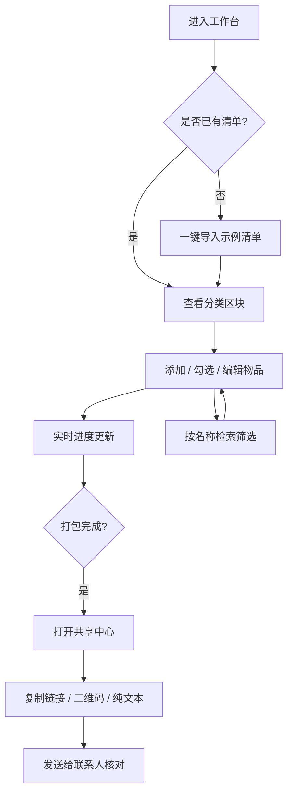

## 1. 产品概述

「行囊 · Packwell」是一款专注于旅行物品清单管理的 Web 应用，帮助用户在出行前快速对照、分类整理行李，并通过链接与联系人共享清单协同打包。
- 解决问题：出行前容易遗漏物品、清单分散在多处、与他人协作打包时信息不同步。
- 目标用户：频繁旅行者、家庭出行组织者、团队出行领队，希望以一份可分类、可检索、可共享的清单贯穿整个打包流程。

## 2. 核心功能

### 2.1 用户角色
| 角色 | 注册方式 | 核心权限 |
|------|---------|---------|
| 普通用户 | 本地免登录（数据存于浏览器） | 创建/编辑/删除清单与物品、分类管理、检索、生成共享链接 |
| 共享访客 | 通过共享链接打开 | 只读查看清单内容、查看打包进度（不可编辑） |

### 2.2 功能模块
1. **清单工作台**：分类列表、物品勾选、进度统计、快速检索、批量操作。
2. **分类管理**：内置常用旅行分类（证件财物、衣物、洗漱护理、电子设备、药品急救、其他），支持自定义新增分类。
3. **共享中心**：生成可分享链接、二维码导出、复制清单为纯文本。

### 2.3 页面详情
| 页面名称 | 模块名称 | 功能描述 |
|---------|---------|---------|
| 清单工作台 | 顶部进度条 | 显示总进度百分比、已打包/总数、当前旅行标题编辑 |
| 清单工作台 | 检索栏 | 按物品名称实时筛选，支持仅看未打包切换 |
| 清单工作台 | 分类区块 | 按分类展示物品，每项支持勾选/编辑/删除，区块可折叠 |
| 清单工作台 | 添加面板 | 浮层形式新增物品，可选分类、设数量、添加备注 |
| 清单工作台 | 空状态引导 | 首次进入展示示例清单模板一键导入 |
| 分类管理 | 分类抽屉 | 侧滑抽屉列出全部分类，支持新增/重命名/删除/排序 |
| 共享中心 | 共享弹窗 | 展示分享链接、二维码、复制纯文本按钮，含进度概览 |

## 3. 核心流程

**主要用户流程**：用户进入工作台 →（可选）一键导入示例清单 → 按分类添加物品 → 边打包边勾选 → 通过检索快速定位 → 打包完成后生成共享链接发送给联系人核对。

## 4. 用户界面设计

### 4.1 设计风格
- **主色调**：暖沙米色背景（#F4ECE0）+ 墨绿主色（#2F4A3C）+ 赭石橙强调色（#C8643A），辅以旧地图米黄纸质感。
- **次色调**：深棕文字（#3A2E22）、柔灰边框（#D9CDB8）、印章红点缀（#A23B2A）。
- **按钮风格**：圆角矩形（8px），主按钮实心墨绿带轻微阴影，次按钮线框赭石，危险按钮印章红描边。
- **字体**：标题用 `Fraunces`（带复古衬线感的展示字体），正文用 `Spectral`（人文衬线），数字/标签用 `JetBrains Mono`。
- **布局风格**：桌面优先单栏卡片布局，左侧固定旅行标题与进度，主区域为分类卡片纵向流。
- **图标 / 装饰**：使用线条图标（lucide 风格），点缀护照印章、虚线航线、邮票齿孔等旅行元素纹理。
- **质感细节**：背景叠加极淡噪点纸张纹理，卡片带细虚线边框模拟行李标签。

### 4.2 页面设计概览
| 页面名称 | 模块名称 | UI 元素 |
|---------|---------|---------|
| 清单工作台 | 顶部进度条 | 米色卡片、墨绿进度条、Fraunces 大标题、JetBrains Mono 百分比数字 |
| 清单工作台 | 检索栏 | 圆角输入框、放大镜图标、未打包切换开关 |
| 清单工作台 | 分类区块 | 卡片式分组、分类图标 + 名称、物品行带复选框、悬停浮现操作按钮 |
| 清单工作台 | 添加面板 | 居中浮层、表单分组、分类下拉、数量步进器、备注输入 |
| 分类管理 | 分类抽屉 | 右侧滑出抽屉、分类列表行、拖拽手柄、新增按钮 |
| 共享中心 | 共享弹窗 | 居中弹窗、二维码画布、链接输入框（只读）、复制按钮 |

### 4.3 响应式
- 桌面优先（≥1024px）单栏居中最大宽度 960px。
- 平板（768–1023px）保持单栏，缩小内边距。
- 移动端（<768px）进度条吸顶、分类卡片全宽、添加面板底部抽屉化、分类管理全屏抽屉。
- 触控优化：勾选区域最小 44×44px，操作按钮加大点击热区。

### 4.4 3D 场景指引
不适用（本项目无 3D 场景需求）。
