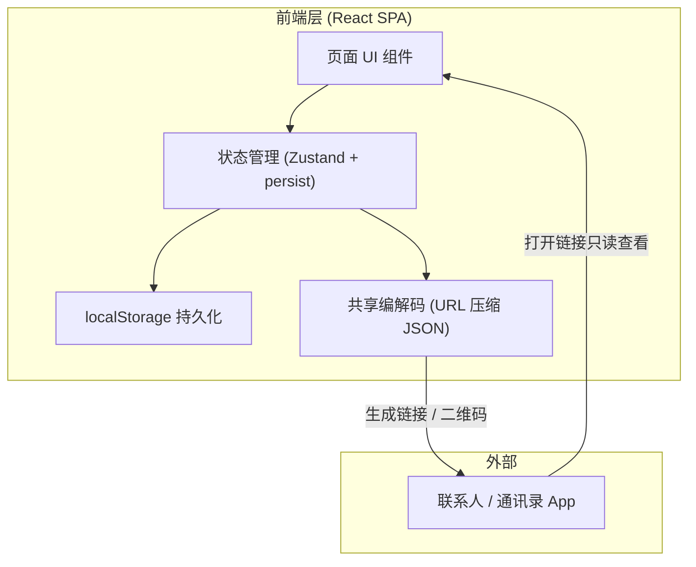
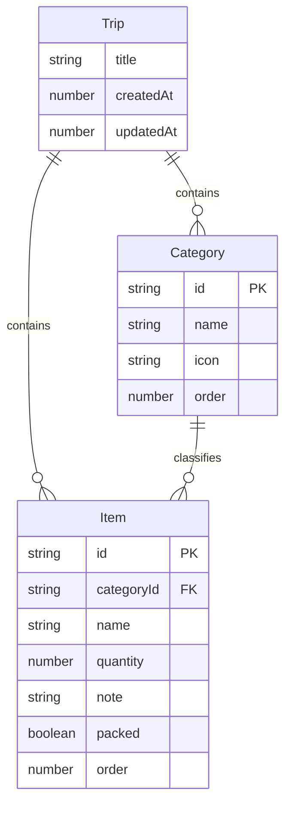

## 1. 架构设计

本项目为纯前端单页应用，数据持久化于浏览器 localStorage，无后端服务；共享通过将清单数据编码进 URL（压缩 JSON）实现，访客打开链接即可只读查看。



## 2. 技术说明
- **前端框架**：React@18 + tailwindcss@3 + vite
- **初始化工具**：vite-init（`npm create vite@latest`）
- **状态管理**：Zustand + `zustand/middleware` 的 `persist` 中间件（持久化到 localStorage）
- **二维码**：`qrcode` 库（生成共享二维码）
- **压缩**：`lz-string`（将清单 JSON 压缩后编入 URL，避免链接过长）
- **图标**：`lucide-react`
- **字体**：Google Fonts 引入 Fraunces / Spectral / JetBrains Mono
- **后端**：无
- **数据库**：无（localStorage 即数据源）

## 3. 路由定义
| 路由 | 用途 |
|------|------|
| `/` | 清单工作台主页面（含进度、检索、分类区块、添加面板入口） |
| `/share?d=<压缩数据>` | 共享只读视图，解析 URL 中的清单数据并以只读模式展示 |

## 4. API 定义
无后端，无 API。共享数据通过 URL query 参数 `d` 传递，值为 `lz-string` 压缩后的 JSON 字符串，结构如下：

```typescript
// 共享数据载荷结构
interface SharedPayload {
  title: string;            // 旅行标题
  categories: Category[];   // 分类列表
  items: Item[];            // 物品列表
  exportedAt: number;       // 导出时间戳
}

interface Category {
  id: string;
  name: string;
  icon: string;             // lucide 图标名
  order: number;
}

interface Item {
  id: string;
  categoryId: string;
  name: string;
  quantity: number;
  note?: string;
  packed: boolean;
  order: number;
}
```

## 5. 服务端架构图
不适用（无后端）。

## 6. 数据模型

### 6.1 数据模型定义
本地状态以单个「旅行清单」为根聚合，包含标题、分类、物品三部分，全部持久化在 localStorage 的 `packwell-store` 键下。



### 6.2 数据定义语言
本项目无关系型数据库，以下为 localStorage 初始数据结构示例（JSON），首次启动若无数据则写入示例清单：

```json
{
  "title": "京都七日行",
  "createdAt": 1752192000000,
  "updatedAt": 1752192000000,
  "categories": [
    { "id": "cat-doc", "name": "证件财物", "icon": "Wallet", "order": 0 },
    { "id": "cat-cloth", "name": "衣物", "icon": "Shirt", "order": 1 },
    { "id": "cat-toilet", "name": "洗漱护理", "icon": "Droplets", "order": 2 },
    { "id": "cat-tech", "name": "电子设备", "icon": "Plug", "order": 3 },
    { "id": "cat-med", "name": "药品急救", "icon": "Pill", "order": 4 },
    { "id": "cat-other", "name": "其他", "icon": "Package", "order": 5 }
  ],
  "items": [
    { "id": "i1", "categoryId": "cat-doc", "name": "护照", "quantity": 1, "note": "有效期6个月以上", "packed": false, "order": 0 },
    { "id": "i2", "categoryId": "cat-doc", "name": "日元现金", "quantity": 1, "note": "约5万日元", "packed": false, "order": 1 },
    { "id": "i3", "categoryId": "cat-cloth", "name": "内衣", "quantity": 7, "note": "", "packed": false, "order": 0 },
    { "id": "i4", "categoryId": "cat-tech", "name": "充电宝", "quantity": 1, "note": "≤100Wh可登机", "packed": false, "order": 0 }
  ]
}
```
